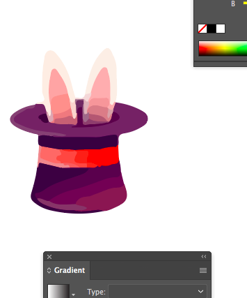
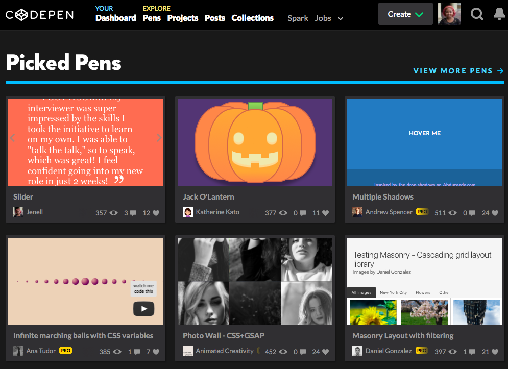

# 100 Days Of Code - Log

## Day 2: October 18, 2017
#### Rabbit Modal 

**Today's Progress**: 
Gave up on Inkscape. Officially traced a rabbit in the hat from the screenshot of the gif!

**Thoughts:** 
This was pretty darn cool! I'm not typically a design person so this was awesome. I really want to sort out how to make some of these images simpler so that I can isolate and re-type the svg code that gets rendered.

**Goals:**
Try to find a simpler rendition of a rabbit in a hat to see if I can isolate the svg code by new classes like "left-ear" and "right-ear" instead of what's given. 

**Link to work:**
- [Link to Work](images/rabbit.svg)
- [Twitter Recap](https://twitter.com/nellarro/status/920866519449526277)
- 

## Day 1: October 17, 2017
#### Rabbit Modal 

**Today's Progress**: 
Finally took the plunge and got Adobe Illustrator! Watched some how tos and failed a little at making bunny ears. 

**Thoughts:** 
Pretty stoked right now. This needed to happen. Although I'm a little sad that free options didn't pan out. 

**Goals:**
Hat. Hat needs to happen tomorrow. Without fail. 

**Link to work:**
- [Twitter Recap](https://twitter.com/nellarro/status/920505367037140993)

## Day 0: October 16, 2017
#### Rabbit Modal 

**Today's Progress**: 
Created the boilerplate for the rabbit gif that I'll be teaching a co-worker how to make! Downloaded Inkscape to start creating the bunny and hat SVG.

**Thoughts:** 
Spelling is hard. I used to be a great speller before I became a dev. There was a point where showModal wasn't closing because I spelled showModal in one place as showModel. *sigh*

**Goals:**
Create the hat in Inkscape tomorrow. 

**Link to work:**
- [Links to Work](https://codepen.io/nellarro/full/XeygXj/)
- [Twitter Recap](https://twitter.com/nellarro/status/920079675598221312)
- 
